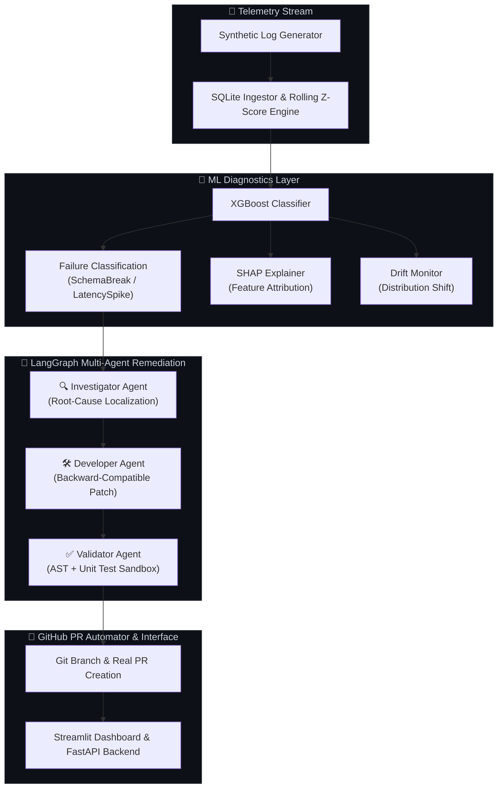

<div align="center">

# ⚡ AutoHeal-ML
### Autonomous Multi-Agent Self-Healing MLOps Platform

[](https://python.org)
[](https://xgboost.ai)
[](https://langchain.com)
[](https://streamlit.io)
[](https://fastapi.tiangolo.com)
[](https://docker.com)
[](https://github.com)

<br/>

> **Production-grade autonomous self-healing pipeline** — real-time telemetry anomaly detection → XGBoost root-cause ML → SHAP explainability → LangGraph multi-agent code remediation → automated GitHub PRs. Zero human intervention required.

</div>

---

## 📸 Dashboard Preview

| Telemetry & Z-Scores | Root-Cause ML & SHAP |
|---|---|
| Live scatter anomaly detection with Z-score color scale | XGBoost classification with SHAP gradient attribution bars |

| Multi-Agent Remediation | Git Diff & PR Automation |
|---|---|
| LangGraph stepper timeline (Investigate → Develop → Validate) | Syntax-highlighted diff viewer + real GitHub PR creation |

---

## 🏗️ Architecture



<details>
<summary><b>View Text Architecture Diagram</b></summary>

```text
====================================================================
                     AutoHeal-ML Platform
====================================================================

  📡 Telemetry Stream
     └─ Synthetic log generator (HTTP metrics, error codes)
     └─ SQLite ingestor with rolling Z-score engine
                          │
                          ▼
  🧬 ML Diagnostics Layer
     └─ XGBoost Classifier  →  SchemaBreak / LatencySpike / ...
     └─ SHAP Explainer      →  Feature attribution per event
     └─ Drift Monitor       →  Distribution shift detection
                          │
                          ▼
  🤖 LangGraph Multi-Agent Remediation
     └─ 🔍 Investigator Agent  →  Root-cause localization
     └─ 🛠️ Developer Agent     →  Backward-compatible patch
     └─ ✅ Validator Agent    →  AST + unit test sandbox
                          │
                          ▼
  🐙 GitHub PR Automator
     └─ Creates branch  →  commits patch  →  opens real PR

  🖥️ Streamlit Dashboard   ·   🚀 FastAPI Backend   ·   🐳 Docker
====================================================================
```
</details>

---

## 🧠 Core Pillars

### 1. 📡 Telemetry & Anomaly Detection
- Synthetic telemetry generator with configurable anomaly injection
- SQLite-backed ingestor with rolling Z-score engine
- Z-score spike detection (`|Z| ≥ 2.0`) across latency, error rates, payload sizes

### 2. 🧬 ML Diagnostics (XGBoost + SHAP)
- **XGBoost Classifier** — multi-class failure mode classification:
  - `SchemaBreak` · `LatencySpike` · `TypeMismatch` · `AuthFailure`
- **SHAP Explainer** — local feature attribution for every prediction
- **Drift Monitor** — distribution shift detection across telemetry batches

### 3. 🤖 Multi-Agent Remediation (LangGraph)
| Agent | Role |
|---|---|
| 🔍 **Investigator** | Locates broken payload keys & codebase symbols |
| 🛠️ **Developer** | Writes backward-compatible code patches |
| ✅ **Validator** | AST syntax check + unit test sandbox execution |

### 4. 🐙 GitHub PR Automation (PyGithub)
- Creates a dedicated `autoheal/patch-<id>` branch
- Commits the generated patch file
- Opens a real GitHub Pull Request with full incident summary

### 5. 🖥️ Streamlit Dashboard (Cyberpunk Design)
- Deep glassmorphism UI with electric cyan/indigo accent system
- 4 tabs: Telemetry · Root-Cause ML · Multi-Agent · Git Diffs & PRs
- Real-time Z-score scatter charts, SHAP gradient bars, styled diff viewer

---

## 🚀 Quick Start

### Prerequisites
```bash
brew install libomp   # macOS — required for XGBoost
```

### 1. Clone & Install
```bash
git clone https://github.com/harishrobin11/AutoHeal_ML_Pipelines.git
cd AutoHeal_ML_Pipelines
python -m venv venv && source venv/bin/activate
pip install -r requirements.txt
```

### 2. Configure Environment
```bash
cp .env.example .env
# Edit .env:
#   GITHUB_TOKEN=ghp_your_token_here   (needs "repo" scope)
#   GITHUB_REPO=harishrobin11/AutoHeal_ML_Pipelines
```

### 3. Launch Dashboard
```bash
python -m streamlit run dashboard/app.py
# Open http://localhost:8501
```

### 4. Launch FastAPI Backend *(optional)*
```bash
uvicorn src.backend.app:app --reload
```

### 5. Run Tests
```bash
pytest tests/ -v
```

---

## 🐳 Docker Deployment

```bash
docker-compose up --build
```

---

## 📁 Project Structure

```
AutoHeal_ML_Pipelines/
├── dashboard/
│   └── app.py                    # Streamlit cyberpunk dashboard
├── src/
│   ├── telemetry/
│   │   ├── generator.py          # Synthetic telemetry generator
│   │   ├── ingestor.py           # SQLite ingestor
│   │   └── zscore_engine.py      # Rolling Z-score anomaly engine
│   ├── ml_engine/
│   │   ├── train_classifier.py   # XGBoost root-cause classifier
│   │   ├── shap_explainer.py     # SHAP feature attribution engine
│   │   └── drift_monitor.py      # Telemetry drift monitor
│   ├── agentic_pipeline/
│   │   ├── state_machine.py      # LangGraph orchestrator
│   │   └── agents/
│   │       ├── investigator.py   # Investigator agent
│   │       ├── developer.py      # Developer agent (patch synthesis)
│   │       └── validator.py      # Validator agent (AST + tests)
│   └── backend/
│       ├── app.py                # FastAPI WebSocket backend
│       └── pr_automator.py       # GitHub PR automation (PyGithub)
├── patches/                      # Auto-generated patch files
├── tests/                        # Pytest test suite
├── .env.example                  # Environment variable template
├── docker-compose.yml
└── requirements.txt
```

---

## 🔧 Tech Stack

| Layer | Technology |
|---|---|
| ML Engine | XGBoost · SHAP · scikit-learn |
| Agent Framework | LangGraph · LangChain |
| Anomaly Detection | Z-Score Rolling Window · SQLite |
| Dashboard | Streamlit · Plotly · Custom CSS |
| Backend | FastAPI · WebSockets · Uvicorn |
| PR Automation | PyGithub REST API |
| Containerization | Docker · docker-compose |
| CI/CD | GitHub Actions |

---

<div align="center">

**Built with ⚡ by [Harish Robin](https://github.com/harishrobin11)**

*AutoHeal-ML — Autonomous Self-Healing, Zero Human Intervention*

</div>
